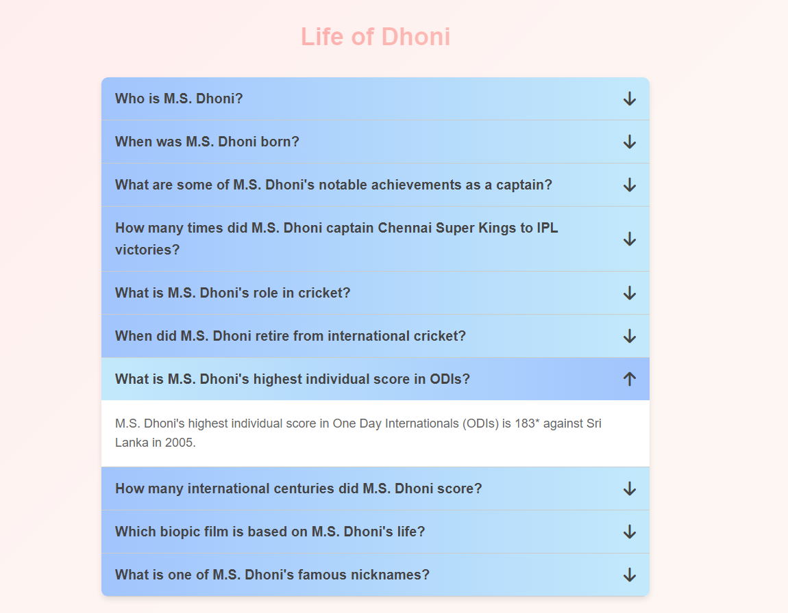

[link to font-awesome CDN](https://cdnjs.com/libraries/font-awesome)



### Explanation of Code with 'active' Classes

1. **Selecting Accordion Titles**:
    ```javascript
    const getAccordionTitles = document.querySelectorAll(".accordion_title");
    ```
    This line selects all elements with the class name `accordion_title` and stores them in the `getAccordionTitles` variable. This variable is a NodeList, which is similar to an array.

2. **Logging the Selected Elements**:
    ```javascript
    console.log("====================================");
    console.log(getAccordionTitles);
    console.log("====================================");
    ```
    These lines log the `getAccordionTitles` NodeList to the console, which helps in debugging to see what elements have been selected.

3. **Adding Event Listeners**:
    ```javascript
    getAccordionTitles.forEach((currentItem) => {
      currentItem.addEventListener("click", (event) => {
        if (currentItem.classList.contains("active")) {
          currentItem.classList.remove("active");
        } else {
          let getAlreadyAddedActiveClasses = document.querySelectorAll(".active");
  
          getAlreadyAddedActiveClasses.forEach((currentActiveItem) => {
            currentActiveItem.classList.remove("active");
          });
  
          currentItem.classList.add("active");
        }
      });
    });
    ```
    - **Iterating through Accordion Titles**:
      ```javascript
      getAccordionTitles.forEach((currentItem) => {
      ```
      This line loops through each element in the `getAccordionTitles` NodeList.
    
    - **Adding Click Event Listener**:
      ```javascript
      currentItem.addEventListener("click", (event) => {
      ```
      For each `currentItem` (accordion title), an event listener is added for the `click` event. When an accordion title is clicked, the following logic is executed:
    
      - **Toggling the 'active' Class**:
        ```javascript
        if (currentItem.classList.contains("active")) {
          currentItem.classList.remove("active");
        } else {
        ```
        If the clicked `currentItem` already has the `active` class, it is removed. This collapses the accordion section if it is already expanded.
    
        - **Removing 'active' Class from Other Items**:
          ```javascript
          let getAlreadyAddedActiveClasses = document.querySelectorAll(".active");

          getAlreadyAddedActiveClasses.forEach((currentActiveItem) => {
            currentActiveItem.classList.remove("active");
          });
          ```
          If the clicked `currentItem` does not have the `active` class, the code first finds all elements with the `active` class (`getAlreadyAddedActiveClasses`), and then it iterates through these elements and removes the `active` class from each one. This ensures that only one accordion section can be expanded at a time.
    
        - **Adding 'active' Class to Current Item**:
          ```javascript
          currentItem.classList.add("active");
          ```
          Finally, the `active` class is added to the clicked `currentItem`, expanding the corresponding accordion section.


This code manages the `active` class to ensure that only one accordion section is expanded at a time. Clicking on an accordion title toggles its expansion state: if it is already expanded, it collapses, and if it is collapsed, it expands while collapsing any other expanded section.
