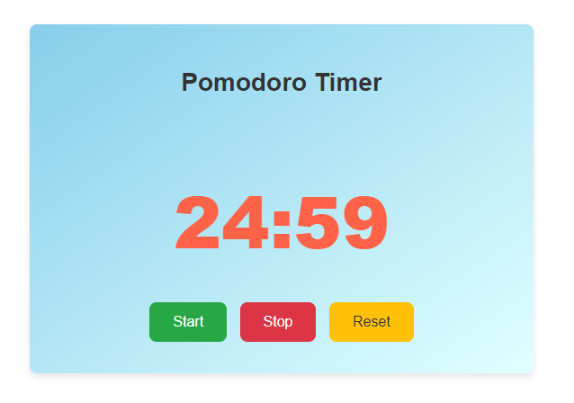
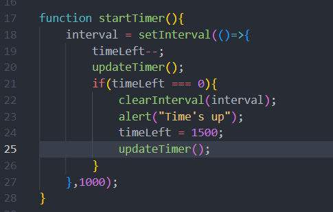

================================================================

## How It Works

1) **`timeLeft--`**: Decreases the **`timeLeft`** variable by 1.
2) **`updateTimer()`**: Updates the timer display.
3) Check**`timeLeft === 0`**: If **`timeLeft`** reaches 0:

- **`clearInterval(interval)`**: Stops the interval, preventing further execution.
- **`alert("Time's up")`**: Displays an alert saying "Time's up".
- **`timeLeft = 1500`**: Resets **`timeLeft`** to 1500 seconds (25 minutes).
- **`updateTimer()`**: Updates the timer display to show the reset time.

### The **`1000`** value in **`setInterval()`** ensures that the code inside the function is executed every second, effectively creating a timer that counts down every second.

