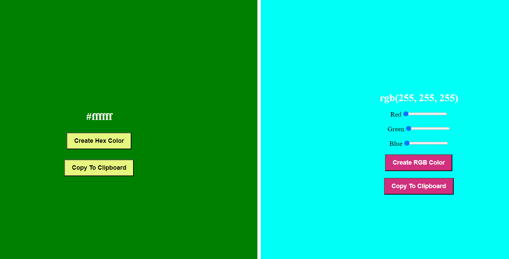

# Color Generator

This JavaScript code provides functionality for generating random HEX and RGB colors, displaying them, and copying them to the clipboard.

## Features

- Generate a random HEX color.
- Generate an RGB color based on user input.
- Copy the generated HEX or RGB color to the clipboard.

## Code Explanation

### Selecting HTML Elements

First, we select the necessary HTML elements using `document.querySelector`:

```javascript
const hexBtn = document.querySelector(".hex-btn");
const hexColorValue = document.querySelector(".hex-color-value");
const hexColorContainer = document.querySelector(".hex-color-container");
const hexCopyBtn = document.querySelector(".hex-copy-color");

const rgbBtn = document.querySelector(".rgb-btn");
const getRedInputRange = document.querySelector("#red");
const getGreenInputRange = document.querySelector("#green");
const getBlueInputRange = document.querySelector("#blue");
const rgbColorContainer = document.querySelector(".rgb-color-container");
const rgbCopyBtn = document.querySelector(".rgb-copy-color");
const rgbColorValue = document.querySelector(".rgb-color-value");
```

## Generating a Random HEX Color

When the HEX color button is clicked, a random HEX color is generated:
```javascript
hexBtn.addEventListener("click", () => {
  let characterSet = "0123456789ABCDEF";
  let hexColorOutput = "";

  for (let i = 0, charSetLength = characterSet.length; i < 6; ++i) {
    hexColorOutput += characterSet.charAt(
      Math.floor(Math.random() * charSetLength)
    );
  }

  hexColorValue.textContent = `#${hexColorOutput}`;
  hexColorContainer.style.backgroundColor = `#${hexColorOutput}`;
  hexBtn.style.color = `#${hexColorOutput}`;
});

```
## Generating an RGB Color

When the RGB color button is clicked, an RGB color is generated based on the values from the input range elements:

```javascript
rgbBtn.addEventListener("click", () => {
  let extractRedValue = getRedInputRange.value;
  let extractGreenValue = getGreenInputRange.value;
  let extractBlueValue = getBlueInputRange.value;

  rgbColorValue.textContent = `rgb(${extractRedValue}, ${extractGreenValue}, ${extractBlueValue})`;
  rgbColorContainer.style.backgroundColor = `rgb(${extractRedValue}, ${extractGreenValue}, ${extractBlueValue})`;
  rgbBtn.style.color = `rgb(${extractRedValue}, ${extractGreenValue}, ${extractBlueValue})`;
});


```

## Copying Colors to Clipboard

The following functions allow users to copy the generated colors to the clipboard:

```javascript

function copyHexColorToClipBoard() {
  navigator.clipboard.writeText(hexColorValue.textContent);
  alert("Hex Color is copied to clipboard");
}

hexCopyBtn.addEventListener("click", copyHexColorToClipBoard);

function copyRgbColorToClipboard() {
  navigator.clipboard.writeText(rgbColorValue.textContent);
  alert("RGB Color is copied to clipboard");
}

rgbCopyBtn.addEventListener("click", copyRgbColorToClipboard);

```

These functions use the navigator.clipboard.writeText method to copy the text content of the color value elements to the clipboard and then display an alert to the user indicating that the color has been copied.

## Usage

### Generate HEX Color
Click the "Generate HEX Color" button to generate a random HEX color.

### Generate RGB Color
Adjust the red, green, and blue range inputs, then click the "Generate RGB Color" button to create an RGB color.

### Copy Colors
Click the "Copy HEX Color" or "Copy RGB Color" button to copy the respective color value to the clipboard.

The functions use the `navigator.clipboard.writeText` method to copy the text content of the color value elements to the clipboard and then display an alert to the user indicating that the color has been copied.
