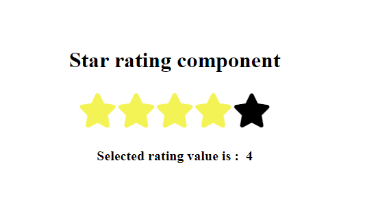

### documentation of transofrm/translate function

https://developer.mozilla.org/en-US/docs/Web/CSS/transform-function/translate

### docmentation of Pseudo elements

https://developer.mozilla.org/en-US/docs/Web/CSS/Pseudo-elements 

------

# Code Explanation

This JavaScript code is used to implement a star rating system on a webpage. Here's a detailed explanation of each part:

#### Variables and Initialization

```javascript
const stars = document.querySelectorAll(".fa-star-o");
const selectedRatingValueText = document.querySelector(".selected-rating-value");
let currentTotalSelectedStars = -1;
```

- `stars`: This variable holds all elements with the class `fa-star-o`, which represents unselected stars.
- `selectedRatingValueText`: This variable holds the element where the selected rating value will be displayed.
- `currentTotalSelectedStars`: This variable keeps track of the current total number of selected stars. It is initialized to `-1`, meaning no stars are selected initially.

#### Adding Event Listeners to Stars

```javascript
stars.forEach((starItem, index) => {
  starItem.dataset.rating = index + 1;
  starItem.addEventListener("mouseover", handleMouseOver);
  starItem.addEventListener("click", handleOnClick);
  starItem.addEventListener("mouseleave", handleMouseLeave);
});
```

- Each star element is assigned a `rating` data attribute corresponding to its position (1 to 5).
- Three event listeners are added to each star:
  - `mouseover`: Triggers the `handleMouseOver` function when the mouse is over a star.
  - `click`: Triggers the `handleOnClick` function when a star is clicked.
  - `mouseleave`: Triggers the `handleMouseLeave` function when the mouse leaves a star.

#### `handleMouseOver` Function

```javascript
function handleMouseOver(event) {
  const currentRatingValue = event.target.dataset.rating;
  if (!currentRatingValue) return;
  else handleUpdateRatingState(currentRatingValue);
}
```

- This function is called when the mouse hovers over a star.
- It retrieves the `rating` value from the star being hovered over.
- It calls `handleUpdateRatingState` with the current rating value to update the stars' appearance.

#### `handleUpdateRatingState` Function

```javascript
function handleUpdateRatingState(getCurrentRatingValue) {
  for (let i = 0; i < 5; i++) {
    if (i < getCurrentRatingValue) {
      stars[i].classList.replace("fa-star-o", "fa-star");
    } else {
      stars[i].classList.replace("fa-star", "fa-star-o");
    }
  }
}
``` 

- This function updates the appearance of the stars based on the provided rating value.
- It loops through the stars and:
  - Changes the class to `fa-star` for stars that should be filled (based on the rating value).
  - Changes the class to `fa-star-o` for stars that should be unfilled.

#### `handleOnClick` Function

```javascript
function handleOnClick(event) {
  const currentRatingValue = event.target.dataset.rating;
  currentTotalSelectedStars = currentRatingValue;
  handleUpdateRatingState(currentTotalSelectedStars);
  selectedRatingValueText.textContent = currentTotalSelectedStars;
}
```

- This function is called when a star is clicked.
- It retrieves the `rating` value from the clicked star.
- It updates `currentTotalSelectedStars` with the selected rating value.
- It calls `handleUpdateRatingState` to update the stars' appearance based on the new rating.
- It updates the text content of the element displaying the selected rating value.

#### `handleMouseLeave` Function

```javascript
function handleMouseLeave() {
  handleUpdateRatingState(currentTotalSelectedStars);
}
```

- This function is called when the mouse leaves a star.
- It calls `handleUpdateRatingState` with the `currentTotalSelectedStars` to revert the stars' appearance back to the selected rating (if any).

### Summary

This code dynamically updates the appearance of stars to reflect the user's rating selection using mouse interactions. It handles hover, click, and mouse leave events to provide a visual feedback mechanism for star ratings.

----
# Event Object Explanation

In the context of JavaScript event handling, `event` is an object that contains information about the event that occurred, such as a click or mouseover. 

#### The `event` Object

When an event occurs (like a user clicking a button or hovering over an element), an `event` object is created and passed to the event handler function. This object contains various properties and methods that provide information about the event.

For example, in the following event listener:
```javascript
starItem.addEventListener("click", handleOnClick);
```
When the `click` event is triggered, the `handleOnClick` function is called, and the `event` object is passed to it as an argument:
```javascript
function handleOnClick(event) {
  // Function code
}
```

#### `event.target`

The `event.target` property is a reference to the DOM element that triggered the event. For instance, if a user clicks on a star element, `event.target` will be the star element that was clicked.

#### `event.target.dataset.rating`

The `dataset` property is a way to access the data attributes of an element. Data attributes are custom attributes that start with `data-` and can be used to store additional information on an HTML element.

In this case, each star element has a `data-rating` attribute assigned:
```javascript
starItem.dataset.rating = index + 1;
```
This sets the `data-rating` attribute to a value between 1 and 5, depending on the star's position.

When accessing this attribute in the event handler:
```javascript
const currentRatingValue = event.target.dataset.rating;
```
- `event.target` refers to the star element that was interacted with (clicked, hovered, etc.).
- `event.target.dataset` is an object containing all the data attributes of the target element.
- `event.target.dataset.rating` retrieves the value of the `data-rating` attribute from the target element.

This value (`currentRatingValue`) is then used to update the state and appearance of the stars.

### Example in Context

Here's how `event` and `event.target.dataset.rating` are used in the `handleOnClick` function:

```javascript
function handleOnClick(event) {
  const currentRatingValue = event.target.dataset.rating;
  currentTotalSelectedStars = currentRatingValue;
  handleUpdateRatingState(currentTotalSelectedStars);
  selectedRatingValueText.textContent = currentTotalSelectedStars;
}
```

1. `event` is the object representing the click event.
2. `event.target` is the star element that was clicked.
3. `event.target.dataset.rating` gets the rating value (1 to 5) from the clicked star element.
4. `currentRatingValue` stores this rating value.
5. `currentTotalSelectedStars` is updated to this rating value.
6. `handleUpdateRatingState(currentTotalSelectedStars)` updates the stars' appearance based on the new rating.
7. `selectedRatingValueText.textContent` is updated to display the selected rating value.

**In summary, `event` provides context about the event, `event.target` points to the element that triggered the event, and `event.target.dataset.rating` retrieves the custom data attribute value from that element.**
